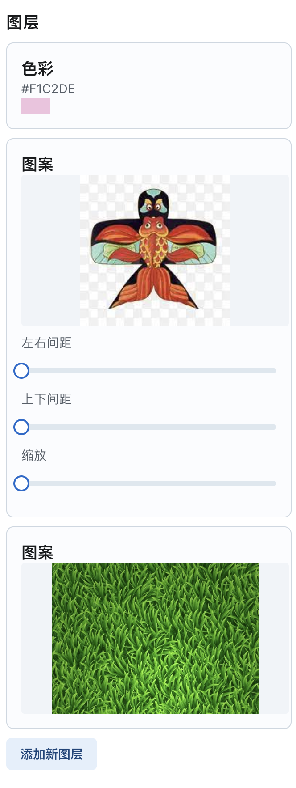

This is a [Next.js](https://nextjs.org/) project bootstrapped with [`create-next-app`](https://github.com/vercel/next.js/tree/canary/packages/create-next-app).

# TL;DR
This is a simple toy project that let users create textures with traditional Chinese swallow kite concepts.
The textures can be used on the cheongsam model immediately.

The textures maker is driven by PIXI.js and the 3D scene is made by Babylon.js

# Todo List
[ ] Layer configuration

[ ] Localization storage of creation by indexDB

[ ] Asset presets

[ ] Make a cartoon shader material, it's a popular style these days.

[ ] Try some approaches to make the model more smooth (cloth simulation ?), any how, at least I should create a normal map

# Progress

## Project setup

## Concept verfication

Generate a dynamic texture and update it to mesh

Verify how to generate texture and update the material of meshes.

## UI Enhancement
I'm pretend to make a sense of working hub
